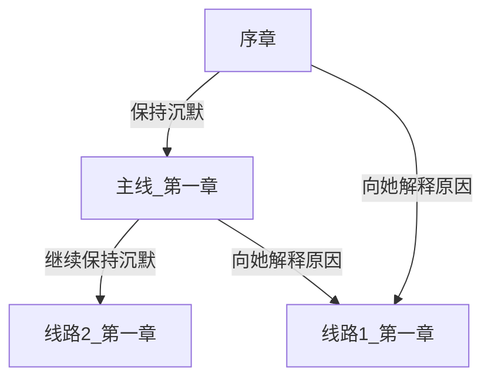
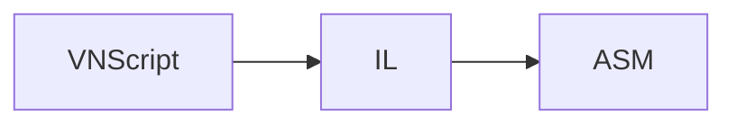

# VNFramework Core

提供 VNFramework 的文本数据解析功能。

主要包括 VNMermaid、VNScript、VNProjectConfig、VNGameSave、VNChapter 等配置文件的解析。

## VNMermaid

借鉴自 Markdown 的 Mermaid 语法，用于实现视觉小说的流程控制。

### Define Syntax

```VNMermaid
# MermaidName [ChapterName]

序章[Chapter00]
主线_第一章[Main_Chapter01]
线路1_第一章[Route1_Chapter01]
线路2_第一章[Route2_Chapter01]
```

### Link Syntax

```VNMermaid
# 当存在OptionText时，节点执行结束后会显示选项按钮
# 当不存在OptionText时，节点执行结束后会自动跳转到下一个节点

# fromNode -->|OptionText| toNode
# fromNode --> toNode

序章 -->|保持沉默| 主线_第一章
主线_第一章 -->|继续保持沉默| 线路2_第一章
主线_第一章 -->|向她解释原因| 线路1_第一章
序章 -->|向她解释原因| 线路1_第一章
```

以上代码会生成如下的流程图：



## VNScript

借鉴自 Markdown ，用于实现视觉小说的剧本演出。

**对话语句**

对话语句有两种格式，一种格式是一行单独的字符串，用于表现主视角角色的陈述或者内心想法。

另一种格式由两个字符串组成（字符串 : 字符串），常用于对话，第一个字符串是说话角色名字，第二个字符串是该角色说的话。

```
# 这是第一种对话格式
写下这篇序言的时候我在赤道以南的巴厘岛，这是我今年第二次来印度尼西亚。

#这是第二种对话格式
江南: 在寂静的夜里点燃蜡烛放在栏杆上，心就安静下来。
```

**继续输出语句**

有的时候我们会希望在文字输出的中间添加一个暂停，等到用户输入一个回车或者是空格之后再继续打印接下来的字符，这样的使用场景下，我们可以使用继续输出的语法。

继续输出语法有两种格式，一种格式是使用符号 ->，它会在用户输入回车之后将新文本输出到旧文本的后面。

另一种是使用符号 > ，它会在用户输出回车之后，另起一个新行输出新文本。

```
# 第一种继续输出方法，将新文本输出到旧文本的后面
写下这篇序言的时候我在赤道以南的巴厘岛，这是我今年第二次来印度尼西亚。
-> 这边的酒店都会给客人准备一个很宽敞的露台，露台上放一盏烛和一盒火柴，
-> 外面是星垂平野，或者雷电打落在海面上，黑暗那么深邃。

# 第二种继续输出方法，另起新行输出新文本
在寂静的夜里点燃蜡烛放在栏杆上，心就安静下来。
> 仿佛一种仪式开始，神秘的气息氤氲的降下，可以开始缓缓的讲诉平生。
```

**全屏文字演出模式**

如果不希望使用底部文本框，而希望使用全屏文本框来输出剧本，可使用全屏文本语法。

全屏文本语法与其他语法的区别在于在句子开头添加 `|` 符号，用于提示语法编辑器此处为全屏文本区域

```
| 写下这篇序言的时候我在赤道以南的巴厘岛，这是我今年第二次来印度尼西亚。
| -> 这边的酒店都会给客人准备一个很宽敞的露台，露台上放一盏烛和一盒火柴，
| -> 外面是星垂平野，或者雷电打落在海面上，黑暗那么深邃。

| 江南 : (chapter01_001)在寂静的夜里点燃蜡烛放在栏杆上，心就安静下来。
| > (chapter01_002)仿佛一种仪式开始，神秘的气息氤氲的降下，可以开始缓缓的讲诉平生。
```

**角色语音语句**

如果希望在输出某段对话时同步播放角色语音，可以在对话的开头使用角色语音语法，即使用圆括号将需要调用的语音名称括起来。

```
江南 : (chapter01_001)在寂静的夜里点燃蜡烛放在栏杆上，心就安静下来。

(chapter01_002)仿佛一种仪式开始，神秘的气息氤氲的降下，可以开始缓缓的讲诉平生。
```

**方法语句**

在一部视觉小说中，不可避免的需要在剧情的进行途中加载背景图片、加载图片立绘、播放音乐。因此剧本格式应该提供一个简便的语法去实现这些功能。

剧本方法的语法是用中括号将函数的名称包裹起来，如果函数需要使用参数，则在方法名称后添加冒号，在冒号后填写函数的参数，参数与参数之间用逗号隔开。

```
# 不使用参数的函数
[ bgm_stop ]

# 使用一个参数的函数
[ bgm_play : audio_name]

# 使用两个参数的函数
[ role_pic: pos, pic_name]
```

常用的命令有以下几种

```
# 显示角色立绘语法
# pos : left / mid / right
# mode : fading / immediate
[ role_pic: pos, pic_name, mode ]

# 播放背景音乐语法
[ bgm: audio_name ]

# 设置音量语法
# 音量大小在 0 ~ 1 之间
# bgm_vol: 背景音乐音量
# bgs_vol: 背景音效音量
# role_vol: 角色语音音量
# 在ILCommand中，role_vol被简写为chs_vol，意为character sound volume
[ bgm_vol: vol_value ]
[ bgs_vol: vol_value ]
[ role_vol: vol_value ]
```


### VNScript 的解释执行流程

在 VNScript 中，看似存在着两种语法，一种是类似于Markdown的标记语法，，另一种是方法。但是实际上，VNScript 的标记语法只是 VNScript 方法的一种封装，为的是更方便剧本的写作。

每一行的VNScript 都对应着一条或多条IL Command(Intermediate Language Command)。

以下是一个转换的示例。

```text
# VNScript
写下这篇序言的时候我在赤道以南的巴厘岛，这是我今年第二次来印度尼西亚。
-> 这边的酒店都会给客人准备一个很宽敞的露台，露台上放一盏烛和一盒火柴，
-> 外面是星垂平野，或者雷电打落在海面上，黑暗那么深邃。

# IL Command
[ open_norm_dialogue_box :  ]
[ dialogue : 写下这篇序言的时候我在赤道以南的巴厘岛，这是我今年第二次来印度尼西亚。 ]
[ dialogue_append : 这边的酒店都会给客人准备一个很宽敞的露台，露台上放一盏烛和一盒火柴， ]
[ dialogue_append : 外面是星垂平野，或者雷电打落在海面上，黑暗那么深邃。 ]
```


但是 `IL Command` 并不是解释执行的最小单元，每一个 `IL Command` 同样也对应着多条 `ASM Command`。

以下是一个转换的示例。

```VNScript
# IL Command
[ open_norm_dialogue_box :  ]
[ dialogue : 写下这篇序言的时候我在赤道以南的巴厘岛，这是我今年第二次来印度尼西亚。 ]
[ dialogue_append : 这边的酒店都会给客人准备一个很宽敞的露台，露台上放一盏烛和一盒火柴， ]
[ dialogue_append : 外面是星垂平野，或者雷电打落在海面上，黑暗那么深邃。 ]

# ASM Command
dialogue clear
dialogue switch norm
dialogue clear
dialogue append 写下这篇序言的时候我在赤道以南的巴厘岛，这是我今年第二次来印度尼西亚。
gm stop
dialogue append 这边的酒店都会给客人准备一个很宽敞的露台，露台上放一盏烛和一盒火柴，
gm stop
dialogue append 外面是星垂平野，或者雷电打落在海面上，黑暗那么深邃。
gm stop
```

这样做的好处是底层永远保持一种原子操作的形式，各层之间的耦合并不紧密。如果想要进行语法的更改或者是替换，成本比较低。

为 VNScrip 扩展语法时，只需要将其解释为对应的 `IL Command` 命令，而增加 `IL Command` 命令时，只需要使用 `ASM Command` 进行组合既可。

VNScript 转换的流程如下：



IL Command如下。

| IL Command                                     | Description                                      |
| ---------------------------------------------- | ------------------------------------------------ |
| [ dialogue: dialogue_content ]                 | 在对话框逐字显示文本                             |
| [ role_dialogue: role_name, dialogue_content ] | 在对话框逐字显示文本, 同时在姓名框显示角色的名称 |
| [ dialogue_continue: dialogue_content ]        | 新文本会在当前文本框的文本后追加                 |
| [ dialogue_newline ]                           | 将文本框内的文本进行换行                         |
| [ clear_dialogue ]                             | 清除对话框中所有的内容                           |
| [ name: role_name]                             | 在姓名框显示角色姓名                             |
| [ clear_name ]                                 | 清除名称框中所有的内容                           |
| [ bgp: pic_name, mode]                         | 以指定的方式显示图片到背景图                     |
| [ bgp_hide: mode ]                             | 以指定的方式将背景图片隐藏                       |
| [ role_pic: pos, pic_name , mode ]             | 在指定的位置以指定的方式显示图片到人物立绘       |
| [ role_pic_hide: pos, mode ]                   | 以指定的方式隐藏指定位置的人物立绘               |
| [ role_act: pos, mode ]                        | 以指定的方式来让人物立绘做出特定的动作           |
| [ bgm_play: audio_name ]                       | 播放背景音乐                                     |
| [ bgm_stop ]                                   | 停止播放背景音乐                                 |
| [ bgm_continue ]                               | 播放被暂停的的背景音乐                           |
| [ bgm_vol: audio_vol ]                         | 设置背景音乐音量大小                             |
| [ bgs_play: audio_name]                        | 播放游戏背景音效                                 |
| [ bgs_stop ]                                   | 停止播放游戏背景音效                             |
| [ gms_play: audio_name ]                       | 播放游戏音效                                     |
| [ gms_stop ]                                   | 停止播放背景音效                                 |
| [ role_say: audio_name ]                       | 播放角色语音                                     |
| [ role_vol: audio_vol ]                        | 设置角色语音音量大小                             |

IL Command 与 Asm 的对应关系如下图。

| IL Command                                     | Asm                                                          |
| ---------------------------------------------- | ------------------------------------------------------------ |
| [ dialogue: dialogue_content ]                 | name clear<br>dialogue clear<br>dialogue append dialogue_content<br>gm stop |
| [ role_dialogue: role_name, dialogue_content ] | name clear<br>dialogue clear<br>name append role_name<br>dialogue append dialogue_content |
| [ dialogue_append: dialogue_content ]          | dialogue append dialogue_content                             |
| [ dialogue_newline ]                           | dialogue newline                                             |
| [ clear_dialogue ]                             | dialogue clear                                               |
| [ name: role_name]                             | name append role_name                                        |
| [ clear_name ]                                 | name clear                                                   |
| [ bgp: pic_name, mode]                         | bgp set pic_name mode                                        |
| [ bgp_hide: mode ]                             | bgp hide mode                                                |
| [ role_pic: pos, pic_name , mode ]             | ch_pos set pic_name mode                                     |
| [ role_pic_hide: pos, mode ]                   | ch_pos hide mode                                             |
| [ role_act: pos, mode ]                        | ch_pos act mode                                              |
| [ bgm_play: audio_name ]                       | bgm play audio_name                                          |
| [ bgm_stop ]                                   | bgm stop                                                     |
| [ bgm_continue ]                               | bgm continue                                                 |
| [ bgm_vol: audio_vol ]                         | bgm vol audio_vol                                            |
| [ bgs_play: audio_name]                        | bgs play audio_name                                          |
| [ bgs_stop ]                                   | bgs stop                                                     |
| [ gms_play: audio_name ]                       | gms play audio_name                                          |
| [ gms_stop ]                                   | gms stop                                                     |
| [ role_say: audio_name ]                       | chs play audio_name                                          |
| [ role_vol: audio_vol ]                        | chs vol audio_vol                                            |