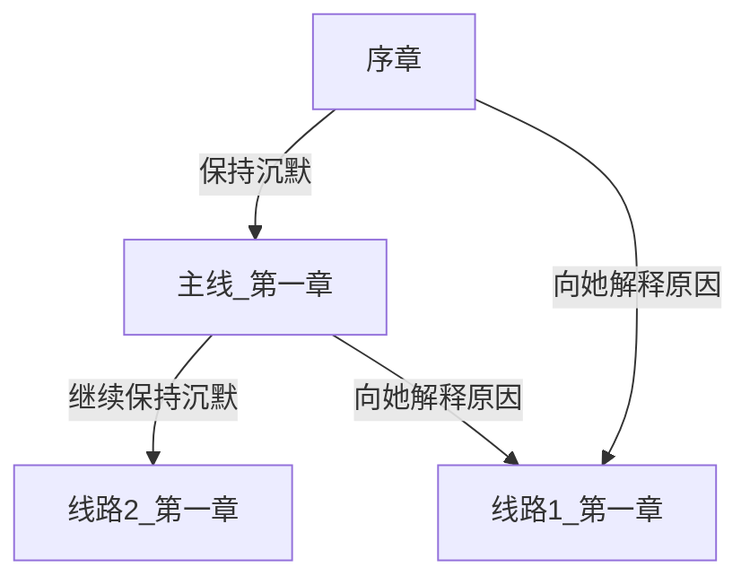

# VNMermaid

借鉴自 Markdown 的 Mermaid 语法，用于实现视觉小说的流程控制。

## Define Syntax

```VNMermaid
# MermaidName [ChapterName]

序章[Chapter00]
主线_第一章[Main_Chapter01]
线路1_第一章[Route1_Chapter01]
线路2_第一章[Route2_Chapter01]
```

## Link Syntax

```VNMermaid
# 当存在OptionText时，节点执行结束后会显示选项按钮
# 当不存在OptionText时，节点执行结束后会自动跳转到下一个节点

# fromNode -->|OptionText| toNode
# fromNode --> toNode

序章 -->|保持沉默| 主线_第一章
主线_第一章 -->|继续保持沉默| 线路2_第一章
主线_第一章 -->|向她解释原因| 线路1_第一章
序章 -->|向她解释原因| 线路1_第一章
```

以上代码会生成如下的流程图：

